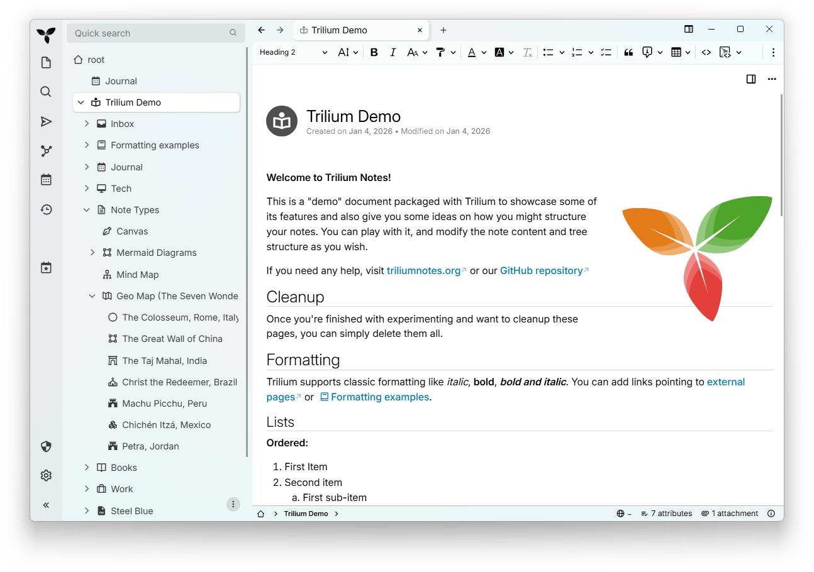

# Trilium Notes


\

\
[](https://hosted.weblate.org/engage/trilium/)

<!-- translate:off -->
<!-- LANGUAGE SWITCHER -->
[Arabic](./README-ar.md) | [Chinese (Simplified Han script)](./README-ZH_CN.md)
| [Chinese (Traditional Han script)](./README-ZH_TW.md) |
[Czech](./README-cs.md) | [English (United Kingdom)](./README-en_GB.md) |
[English](../README.md) | [French](./README-fr.md) | [German](./README-de.md) |
[Greek](./README-el.md) | [Indonesian](./README-id.md) | [Irish](./README-ga.md)
| [Italian](./README-it.md) | [Japanese](./README-ja.md) |
[Korean](./README-ko.md) | [Polish](./README-pl.md) | [Romanian](./README-ro.md)
| [Russian](./README-ru.md) | [Spanish](./README-es.md) |
[Ukrainian](./README-uk.md) | [Urdu](./README-ur.md) | [Uyghur](./README-ug.md)
| [Vietnamese](./README-vi.md)
<!-- translate:on -->

Trilium Notes là một ứng dụng ghi chú phân cấp miễn phí, mã nguồn mở, đa nền
tảng tập trung vào việc xây dựng cơ sở tri thức cá nhân lớn.

Bạn đang tìm kiếm "Trillium Notes"? Cách viết chính xác của dự án là "Trilium
Notes", với một `l`.



## ⏬ Tải xuống
- [Bản phát hành mới
  nhất](https://github.com/TriliumNext/Trilium/releases/latest) – phiên bản ổn
  định, được khuyên dùng cho hầu hết người dùng.
- [Bản dựng
  nightly](https://github.com/TriliumNext/Trilium/releases/tag/nightly) – phiên
  bản phát triển kém ổn định, được cập nhật hàng ngày với các tính năng mới nhất
  và sửa lỗi.

## 📚 Tài Liệu

**Truy cập tài liệu toàn diện của chúng tôi tại
[docs.triliumnotes.org](https://docs.triliumnotes.org/)**

Tài liệu của chúng tôi có sẵn ở nhiều định dạng:
- **Tài liệu trực tuyến**: Xem tài liệu đầy đủ tại
  [docs.triliumnotes.org](https://docs.triliumnotes.org/)
- **Trợ giúp trong ứng dụng**: Nhấn `F1` trong Trilium để truy cập tài liệu
  tương tự trực tiếp trong ứng dụng
- **Github**: Đi đến [Hướng dẫn sử dụng] trong kho lưu trữ này

### Liên Kết Nhanh
- [Hướng Dẫn Bắt Đầu](https://docs.triliumnotes.org/)
- [Hướng Dẫn Cài Đặt](https://docs.triliumnotes.org/user-guide/setup)
- [Thiết Lập
  Docker](https://docs.triliumnotes.org/user-guide/setup/server/installation/docker)
- [Cập Nhật
  TriliumNext](https://docs.triliumnotes.org/user-guide/setup/upgrading)
- [Khái Niệm Và Chức Năng Cơ
  Bản](https://docs.triliumnotes.org/user-guide/concepts/notes)
- [Các Mẫu Cơ Sở Tri Thức Cá
  Nhân](https://docs.triliumnotes.org/user-guide/misc/patterns-of-personal-knowledge)

## 🎁 Chức Năng

* Các ghi chú có thể được sắp xếp thành cây có độ sâu bất kỳ. Một ghi chú có thể
  được đặt vào nhiều nơi trong cây (xem
  [cloning](https://docs.triliumnotes.org/user-guide/concepts/notes/cloning))
* Trình soạn thảo ghi chú WYSIWYG đầy đủ tính năng, hỗ trợ bảng, hình ảnh, và
  [toán học](https://docs.triliumnotes.org/user-guide/note-types/text); đồng
  thời [tự động định
  dạng](https://docs.triliumnotes.org/user-guide/note-types/text) sang markdown
* Hỗ trợ chỉnh sửa [ghi chú chứa mã
  nguồn](https://docs.triliumnotes.org/user-guide/note-types/code), kèm tô sáng
  cú pháp
* [Điều hướng giữa các ghi
  chú](https://docs.triliumnotes.org/user-guide/concepts/navigation/note-navigation)
  nhanh và dễ dàng, tìm kiếm toàn văn và [note
  hoisting](https://docs.triliumnotes.org/user-guide/concepts/navigation/note-hoisting)
* Quản lý [phiên bản ghi
  chú](https://docs.triliumnotes.org/user-guide/concepts/notes/note-revisions)
  mượt mà
* [Các thuộc
  tính](https://docs.triliumnotes.org/user-guide/advanced-usage/attributes) ghi
  chú có thể được dùng cho việc tổ chức, truy xuất và [viết
  script](https://docs.triliumnotes.org/user-guide/scripts) nâng cao
* Giao diện sẵn có cho Tiếng Anh, Tiếng Đức, Tiếng Tây Ban Nha, Tiếng Pháp,
  Tiếng Rumani, và Tiếng Trung (giản thể và phồn thể)
* [Tích hợp OpenID và
  TOTP](https://docs.triliumnotes.org/user-guide/setup/server/mfa) trực tiếp để
  đăng nhập bảo mật hơn
* [Đồng bộ hóa](https://docs.triliumnotes.org/user-guide/setup/synchronization)
  với máy chủ đồng bộ tự triển khai
  * Có các [dịch vụ bên thứ ba để lưu trữ server đồng bộ
    hóa](https://docs.triliumnotes.org/user-guide/setup/server/cloud-hosting)
* [Chia sẻ](https://docs.triliumnotes.org/user-guide/advanced-usage/sharing)
  (công bố) các ghi chú lên mạng Internet công cộng
* [Mã hóa ghi
  chú](https://docs.triliumnotes.org/user-guide/concepts/notes/protected-notes)
  mạnh mẽ với mức chi tiết đến từng ghi chú
* Phác thảo sơ đồ, dựa trên [Excalidraw](https://excalidraw.com/) (loại ghi chú
  "canvas")
* [Sơ đồ quan
  hệ](https://docs.triliumnotes.org/user-guide/note-types/relation-map) và [sơ
  đồ ghi chú/liên
  kết](https://docs.triliumnotes.org/user-guide/note-types/note-map) để trực
  quan hóa các ghi chú và quan hệ của chúng
* Sơ đồ tư duy, dựa trên [Mind Elixir](https://docs.mind-elixir.com/)
* [Bản đồ địa lý](https://docs.triliumnotes.org/user-guide/collections/geomap)
  với các chấm chỉ vị trí và các đường GPX
* [Viết script](https://docs.triliumnotes.org/user-guide/scripts) - xem [Mục
  trưng bày nâng
  cao](https://docs.triliumnotes.org/user-guide/advanced-usage/advanced-showcases)
* [REST API](https://docs.triliumnotes.org/user-guide/advanced-usage/etapi) cho
  tự động hóa
* Mở rộng tốt về cả khả năng sử dụng và hiệu năng lên đến 100.000 ghi chú
* Tối ưu hóa cảm ứng [mobile
  frontend](https://docs.triliumnotes.org/user-guide/setup/mobile-frontend) cho
  điện thoại thông minh và máy tính bảng
* Tích hợp sẵn [giao diện
  tối](https://docs.triliumnotes.org/user-guide/concepts/themes), hỗ trợ giao
  diện do người dùng tùy chỉnh
* Hỗ trợ nhập, xuất cho
  [Evernote](https://docs.triliumnotes.org/user-guide/concepts/import-export/import-from-apps/evernote.html)
  và
  [Markdown](https://docs.triliumnotes.org/user-guide/concepts/import-export/markdown)
* [Web Clipper](https://docs.triliumnotes.org/user-guide/setup/web-clipper) để
  lưu trữ nội dung web dễ dàng
* Giao diện tùy biến (nút thanh bên, widget do người dùng tự tạo,...)
* [Chỉ số](https://docs.triliumnotes.org/user-guide/advanced-usage/metrics),
  cùng với một Grafana Dashboard.

✨ Hãy xem thử các nguồn tài nguyên/cộng đồng bên thứ ba dưới đây để tìm thêm
nhiều tiện ích liên quan đến TriliumNext:

- [awesome-trilium](https://github.com/Nriver/awesome-trilium) cho các chủ đề,
  script, plugin và nhiều hơn nữa.
- [TriliumRocks!](https://trilium.rocks/) cho những hướng dẫn, và nhiều hơn.

## ❓Tại sao là TriliumNext?

Người phát triển ban đầu của Trilium ([Zadam](https://github.com/zadam)) đã hào
phóng tặng kho lưu trữ Trilium cho dự án cộng đồng, hiện đang đặt tại
https://github.com/TriliumNext

### ⬆️ Chuyển từ Zadam/Trilium?

Không cần những bước chuyển đặc biệt nào để chuyển từ zadam/Trilium sang
TriliumNext/Trilium. Đơn giản chỉ cần [cài đặt
TriliumNext/Trilium](#-installation) như thông thường và nó sẽ sử dụng cơ sở dữ
liệu sẵn có của bạn.

Các phiên bản trước và bao gồm
[v0.90.4](https://github.com/TriliumNext/Trilium/releases/tag/v0.90.4) đều tương
thích với phiên bản mới nhất của zadam/trilium
[v0.63.7](https://github.com/zadam/trilium/releases/tag/v0.63.7). Các phiên bản
sau đó của TriliumNext/Trilium đã tăng phiên bản đồng bộ, khiến việc chuyển sang
trực tiếp không còn khả thi.

## 💬 Thảo luận cùng chúng tôi

Hãy thoải mái tham gia các cuộc trò chuyện chính thức. Chúng tôi luôn muốn lắng
nghe các tính năng, đề xuất hoặc vấn đề mà bạn đưa ra!

- [Matrix](https://matrix.to/#/#triliumnext:matrix.org) (Cho những thảo luận
  đồng bộ thời gian thực.)
  - Phòng `General` trong Matrix cũng được kết nối tới
    [XMPP](xmpp:discuss@trilium.thisgreat.party?join)
- [Github Discussions](https://github.com/TriliumNext/Trilium/discussions) (Cho
  những thảo luận không đồng bộ.)
- [Github Issues](https://github.com/TriliumNext/Trilium/issues) (Cho việc báo
  cáo lỗi và yêu cầu tính năng.)

## 🏗 Cài Đặt

### Windows / MacOS

Tải bản phát hành nhị phân cho nền tảng của bạn từ [trang phát hành mới
nhất](https://github.com/TriliumNext/Trilium/releases/latest), giải nén gói và
chạy tệp thực thi `trilium`.

### Linux

Nếu bản phân phối của bạn được liệt kê trong bảng dưới đấy, hãy dùng gói cài đặt
của nó.

[](https://repology.org/project/trilium/versions)

Bạn cũng có thể tải xuống bản phát hành binary cho nền tảng của mình từ [trang
phát hành mới nhất](https://github.com/TriliumNext/Trilium/releases/latest),
giải nén gói và chạy tệp thực thi `trilium`.

TriliumNext cũng được cung cấp dưới dạng Flatpak, nhưng chưa được phát hành trên
FlatHub.

### Trình duyệt (mọi hệ điều hành)

Nếu bạn sử dụng cài đặt server (xem bên dưới), bạn có thể truy cập trực tiếp vào
giao diện web (gần như giống hệt ứng dụng desktop).

Hiện tại chỉ hỗ trợ (và đã kiểm tra) các phiên bản mới nhất của Chrome &
Firefox.

### Di Động

Để sử dụng TriliumNext trên thiết bị di động, bạn có thể sử dụng trình duyệt web
di động để truy cập vào giao diện di động của một cài đặt server (xem bên dưới).

Xem issue https://github.com/TriliumNext/Trilium/issues/4962 để biết thêm thông
tin về hỗ trợ ứng dụng di động.

#### TriliumDroid

Nếu bạn thích một ứng dụng Android native, bạn có thể sử dụng
[TriliumDroid](https://apt.izzysoft.de/fdroid/index/apk/eu.fliegendewurst.triliumdroid).
Báo cáo lỗi và các tính năng thiếu tại [kho mã nguồn của
họ](https://github.com/FliegendeWurst/TriliumDroid). Lưu ý: Tốt nhất là tắt cập
nhật tự động trên cài đặt server của bạn (xem bên dưới) khi sử dụng TriliumDroid
vì phiên bản đồng bộ hóa phải khớp giữa Trilium và TriliumDroid.

#### Pocket Trilium

Nếu bạn muốn một ứng dụng Android native đầy đủ tính năng, hãy xem [Pocket
Trilium](https://github.com/Nriver/pocket-trilium). Nó chạy một instance Trilium
hoàn chỉnh trên điện thoại của bạn, hỗ trợ sử dụng ngoại tuyến đầy đủ và cho
phép bạn đồng bộ hóa với server của mình.

#### Trinote

Nếu bạn muốn có một ứng dụng iOS thuần (native), bạn có thể sử dụng
[Trinote](https://apps.apple.com/us/app/trinote/id6761228249) — một ứng dụng mã
nguồn mở dành cho máy chủ Trilium / TriliumNext tự lưu trữ (self-hosted). Ứng
dụng này cho phép bạn duyệt và sắp xếp cây ghi chú, tìm kiếm ghi chú trên máy
chủ, đọc và chỉnh sửa tất cả các loại ghi chú (văn bản, mã nguồn, sơ đồ tư duy,
bảng tính, bản đồ địa lý, bản vẽ canvas, v.v.), đồng thời giữ cho các ghi chú
luôn sẵn sàng để xem và chỉnh sửa ngay cả khi ngoại tuyến (offline).

### Server

Để cài đặt TriliumNext trên server của riêng bạn (bao gồm cả qua Docker từ
[Dockerhub](https://hub.docker.com/r/triliumnext/trilium)), hãy làm theo [tài
liệu cài đặt server](https://docs.triliumnotes.org/user-guide/setup/server).


## 💻 Đóng góp

### Bản dịch

Nếu bạn là người bản ngữ, hãy giúp chúng tôi dịch Trilium bằng cách truy cập
[trang Weblate](https://hosted.weblate.org/engage/trilium/) của chúng tôi.

Dưới đây là mức độ bao phủ ngôn ngữ mà chúng tôi có cho đến nay:

[](https://hosted.weblate.org/engage/trilium/)

### Mã nguồn

Tải xuống kho mã nguồn, cài đặt các phụ thuộc bằng `pnpm` và sau đó chạy server
(khả dụng tại http://localhost:8080):
```shell
Git clone https://github.com/TriliumNext/Trilium.git
cd Trilium
pnpm install
pnpm run server:start
```

### Tài liệu

Tải xuống kho mã nguồn, cài đặt các phụ thuộc bằng `pnpm` và sau đó chạy môi
trường cần thiết để chỉnh sửa tài liệu:
```shell
Git clone https://github.com/TriliumNext/Trilium.git
cd Trilium
pnpm install
pnpm edit-docs:edit-docs
```

Hoặc, nếu bạn đã cài đặt Nix:
```shell
# Chạy trực tiếp
nix run .#edit-docs

# Hoặc cài đặt vào hồ sơ của bạn
nix profile install .#edit-docs
trilium-edit-docs
```


### Dựng bản thực thi
Tải xuống kho mã nguồn, cài đặt các phụ thuộc bằng `pnpm` và sau đó dựng ứng
dụng desktop cho Windows:
```shell
Git clone https://github.com/TriliumNext/Trilium.git
cd Trilium
pnpm install
pnpm run --filter desktop electron-forge:make --arch=x64 --platform=win32
```

Để biết thêm chi tiết, hãy xem [tài liệu phát
triển](https://github.com/TriliumNext/Trilium/tree/main/docs/Developer%20Guide/Developer%20Guide).

### Tài liệu dành cho nhà phát triển

Vui lòng xem [hướng dẫn tài
liệu](https://github.com/TriliumNext/Trilium/blob/main/docs/Developer%20Guide/Developer%20Guide/Environment%20Setup.md)
để biết chi tiết. Nếu bạn có thêm câu hỏi, hãy liên hệ thông qua các liên kết
được mô tả trong phần "Thảo luận với chúng tôi" ở trên.

## 💖 Nhà tài trợ

<table>
  <tr>
    <td align="center" width="25%">
      <a href="https://www.netperfect.fr">
        <br />
        <b>NetPerfect</b>
      </a>
      <br />EV certificate &amp; Windows CI
    </td>
    <td align="center" width="50%">
      <a href="https://ckeditor.com/ckeditor-5/features/">
        <br />
        <b>CKEditor</b>
      </a>
      <br />Premium editor features
    </td>
    <td align="center" width="25%">
      <a href="https://dosu.dev/">
        <br />
        <b>Dosu</b>
      </a>
      <br />Automated GitHub support
    </td>
  </tr>
</table>

## 👏 Lời cảm ơn

* [Zadam](https://github.com/zadam) vì ý tưởng và việc triển khai ban đầu của
  ứng dụng.
* [Sarah Hussein](https://github.com/Sarah-Hussein) vì đã thiết kế biểu tượng
  ứng dụng.
* [Nriver](https://github.com/nriver) vì công việc quốc tế hóa.
* [Thomas Frei](https://github.com/thfrei) vì công việc ban đầu về Canvas.
* [Antoniotejada](https://github.com/nriver) vì widget tô sáng cú pháp ban đầu.
* [Tabler Icons](https://tabler.io/icons) vì các biểu tượng khay hệ thống.
*   Các biểu tượng ứng dụng trong hộp thoại nhập có nguồn gốc từ:
    *   [Material Design Icons](https://pictogrammers.com/library/mdi/) cho
        OneNote, Google Keep, Evernote.
    *   [Font Awesome](https://fontawesome.com/) cho Notion, Obsidian.
    *   [SVGicons.com](https://svgicons.com/icon/187676/anytype) cho Anytype.
*  Các biểu tượng nhà cung cấp LLM có nguồn gốc từ [Lobe
   Icons](https://lobehub.com/icons).

Trilium sẽ không thể tồn tại nếu không có các công nghệ đằng sau nó:

* [CKEditor 5](https://github.com/ckeditor/ckeditor5) - trình soạn thảo trực
  quan cho các ghi chú văn bản.
* [CodeMirror](https://github.com/codemirror/CodeMirror) - trình soạn thảo mã
  nguồn hỗ trợ một lượng lớn ngôn ngữ.
* [Excalidraw](https://github.com/excalidraw/excalidraw) - bảng trắng vô hạn
  được sử dụng trong các ghi chú Canvas.
* [Mind Elixir](https://github.com/SSShooter/mind-elixir-core) - cung cấp chức
  năng sơ đồ tư duy.
* [Leaflet](https://github.com/Leaflet/Leaflet) - để hiển thị bản đồ địa lý.
* [Tabulator](https://github.com/olifolkerd/tabulator) - cho bảng tương tác được
  sử dụng trong các bộ sưu tập.
* [FancyTree](https://github.com/mar10/fancytree) - thư viện cây phong phú tính
  năng, không có đối thủ thực sự.

## 🤝 Hỗ trợ

Trilium được xây dựng và bảo trì bằng [hàng trăm giờ làm
việc](https://github.com/TriliumNext/Trilium/graphs/commit-activity). Sự hỗ trợ
của bạn giúp duy trì mã nguồn mở, cải thiện tính năng và chi trả các chi phí như
lưu trữ.

Hãy cân nhắc hỗ trợ nhà phát triển chính
([eliandoran](https://github.com/eliandoran)) của ứng dụng thông qua:

- [GitHub Sponsors](https://github.com/sponsors/eliandoran)
- [PayPal](https://paypal.me/eliandoran)
- [Buy Me a Coffee](https://buymeacoffee.com/eliandoran)

## 🔑 Giấy phép

Bản quyền 2017-2025 zadam, Elian Doran và các nhà đóng góp khác

Chương trình này là phần mềm tự do: bạn có thể phân phối lại và/hoặc sửa đổi nó
theo các điều khoản của Giấy phép Công cộng Tổng quát GNU Affero do Free
Software Foundation công bố, phiên bản 3 của Giấy phép hoặc (theo lựa chọn của
bạn) bất kỳ phiên bản nào mới hơn.
