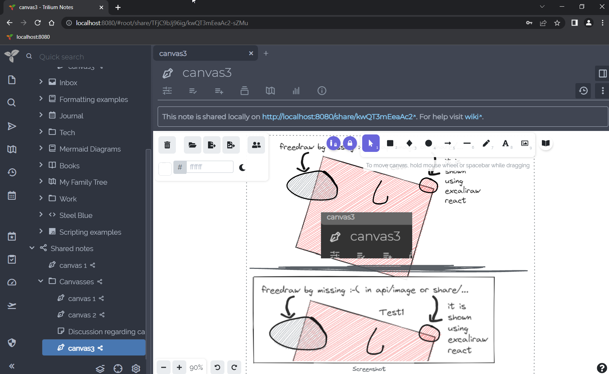

# Canvas
<figure class="image"></figure>

Canvas notes use the Excalidraw library to allow handwritten notes with mouse, pen or touch on an infinite canvas. It also supports basic diagramming, text and graphics input.

## Interaction

*   The note can be togged [read-only](../Basic%20Concepts%20and%20Features/Notes/Read-Only%20Notes.md) from the <a class="reference-link" href="../Basic%20Concepts%20and%20Features/UI%20Elements/Note%20menu.md">Note menu</a>.

## Embedding notes

Since v0.104.0, Canvas supports embedding notes in a similar fashion to the <a class="reference-link" href="Text/Include%20Note.md">Include Note</a> functionality for <a class="reference-link" href="Text.md">Text</a> notes.

To embed a note:

*   From the <a class="reference-link" href="../Basic%20Concepts%20and%20Features/UI%20Elements/Note%20Tree.md">Note Tree</a>, drag the item onto the canvas.
*   Manually, by choosing _More tools_ → _Web Embed_ and pasting the link to the note (e.g. `root/MujWAc9fQ1nj`).

Embedding notes in the canvas follows the same rules as <a class="reference-link" href="Text/Include%20Note.md">Include Note</a>: some notes are rendered as images (e.g. <a class="reference-link" href="Mind%20Map.md">Mind Map</a>), whereas some render fully interactive such as <a class="reference-link" href="../Collections.md">Collections</a>.

## Linking to a note

1.  From the <a class="reference-link" href="../Basic%20Concepts%20and%20Features/UI%20Elements/Note%20Tree.md">Note Tree</a> right click the note to be linked and selected _Advanced → Copy note path to the clipboard_.
2.  In the canvas note, right click an element and select _Add link_ (or press <kbd>Ctrl</kbd>+<kbd>K</kbd>). Paste the link and press <kbd>Enter</kbd>.
3.  A  icon will appear at the top-right of the element which will navigate to the linked note when clicked.

## Drawing in a text note

To draw inside a <a class="reference-link" href="Text.md">Text</a> note instead of in a note of its own, insert a drawing canvas with _Drawing canvas_ in the _Insert_ menu. See _Drawing canvases_ in <a class="reference-link" href="Text/Include%20Note.md">Include Note</a>.