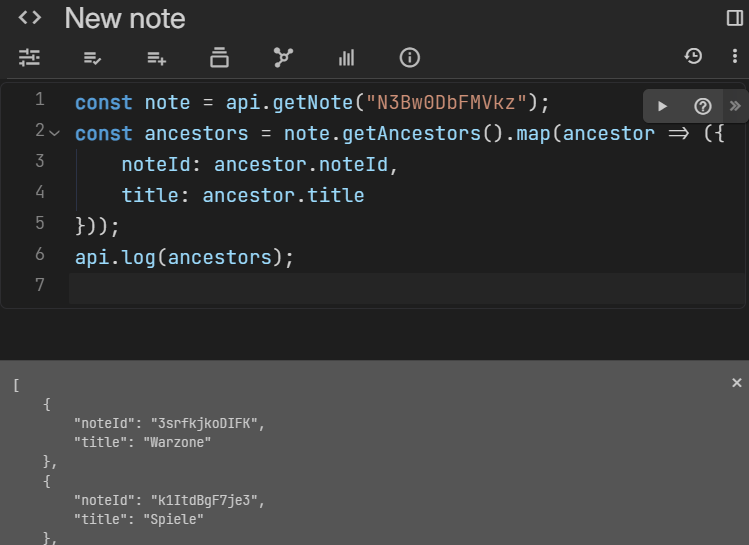

# Logging
Both front-end and back-end notes can log messages for debugging.

## UI logging via `api.log`

<figure class="image image-style-align-center image_resized" style="width:57.74%;"></figure>

The API log feature integrates with the script editor and it displays all the messages logged via `api.log`. This works for both back-end and front-end scripts.

The API log panel will appear at the bottom of a note (including in <a class="reference-link" href="../Basic%20Concepts%20and%20Features/Navigation/Quick%20edit.md">Quick edit</a>) after executing a script that uses `api.log`. It can be dismissed temporarily by pressing the close button in the top-right of the panel.

Apart from strings, an object can be passed as well in which case it will be pretty-formatted if possible (e.g. recursive objects are not supported).

## Console logging

For logs that are not directly visible to the user, the standard `console.log` can be used as well.

*   For front-end scripts, the log will be shown in the Developer Tools (also known as Inspect).
*   For back-end scripts, the log will be shown in the server output while running but **will not** be visible in the <a class="reference-link" href="../Troubleshooting/Error%20logs/Backend%20(server)%20logs.md">Backend (server) logs</a>.